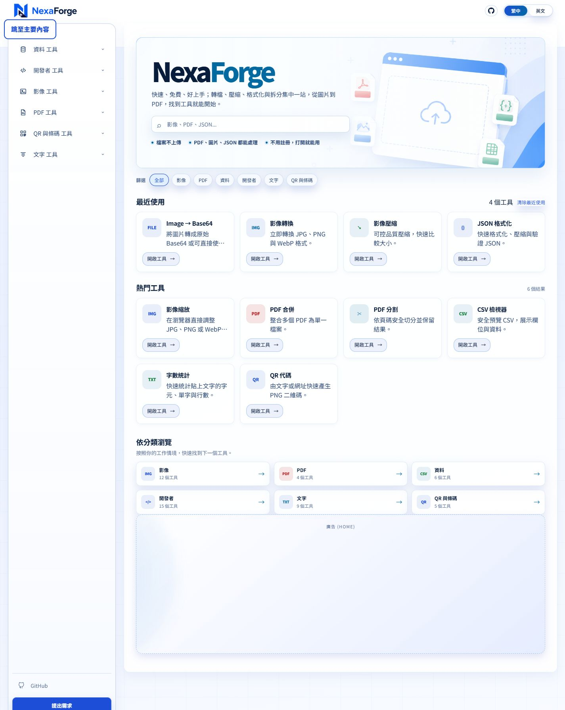
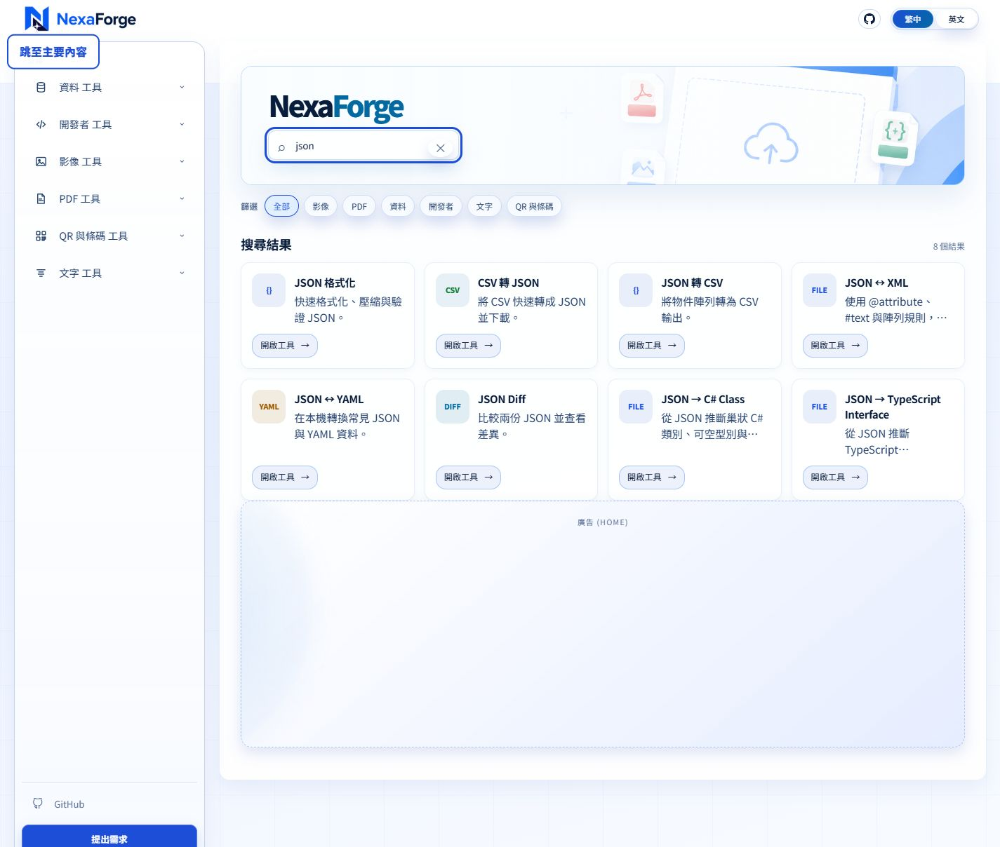
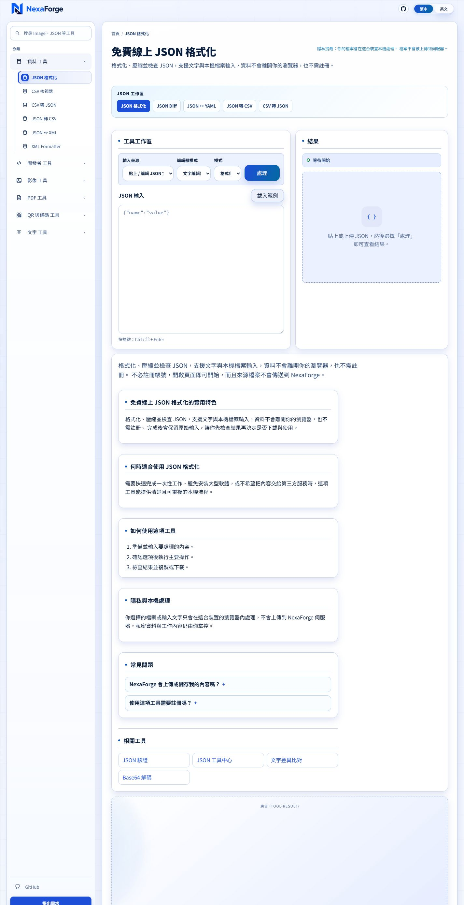
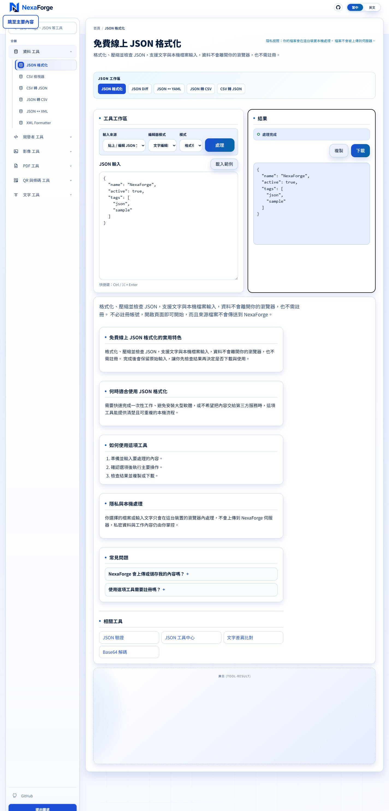
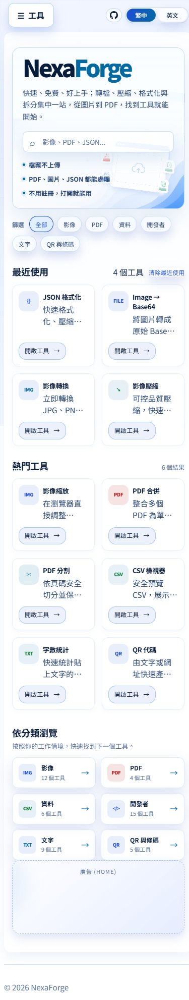
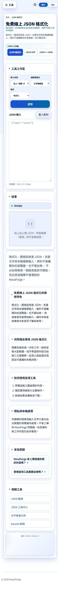

# NexaForge 產品體驗稽核

日期：2026-08-23

## 稽核範圍

- 產品：NexaForge 瀏覽器內本機處理工具集合
- 使用者目標：首次訪客在 30 秒內找到合適工具，並成功完成一次 JSON 格式化任務
- 流程：首頁 → 搜尋 JSON → 開啟 JSON 格式化 → 載入範例並處理 → 檢查結果
- 裝置：桌機 1440 × 1000、手機 390 × 844
- 模式：UX + 可及性風險的合併稽核

## 整體結論

NexaForge 已經不是「功能不夠」的問題，而是「完整工具集合還沒有完全被組織成清楚的產品」。核心價值很強：不用註冊、檔案不需上傳、本機即可完成工作；實際 JSON 任務也能順利完成。最大的改善空間在於降低選擇負擔、把目錄型首頁收斂成任務入口、讓搜尋理解使用意圖，以及把完成後的下一步串成工作流程。

## 流程證據與健康度

### Step 1 — 桌機首頁：健康，但資訊重複

- 強項：價值主張、搜尋、分類、最近使用與熱門工具都能直接看到。
- 風險：左側分類、篩選 chips、熱門工具與分類卡片同時出現，提供了四套相近入口，增加選擇成本。
- 風險：未填入廣告時仍保留大面積空白，讓完成度與信任感下降。

### Step 2 — 搜尋 JSON：健康，但缺少意圖排序

- 強項：輸入後立即縮短頁面，結果數與清除操作清楚。
- 風險：8 個 JSON 結果視覺權重相同；精確匹配、格式轉換、程式碼生成與比較工具沒有分層。
- 建議：先顯示「最可能的任務」，再分成格式化／轉換／比較／產生型別等群組。

### Step 3 — JSON 工作區初始狀態：可用，但前置說明偏多

- 強項：輸入、模式、主要按鈕、輸出為左右對照，心理模型清楚。
- 強項：空狀態說明下一步，處理按鈕在無輸入時停用。
- 風險：頁首標題、隱私提醒、描述、JSON 次導覽與「工具工作區」共同占用首屏注意力。
- 風險：主要動作「處理」過於通用，應依模式顯示「格式化 JSON」或「最小化 JSON」。

### Step 4 — 完成結果：健康

- 強項：處理完成狀態、結果、複製與下載動作都在同一區塊。
- 強項：焦點移到結果區域，對鍵盤使用者是正向設計。
- 風險：結果區粗黑外框容易被解讀成錯誤或選取狀態；保留可見焦點，但應與品牌焦點樣式一致。
- 機會：完成後提供「驗證、轉 CSV、比較差異」等下一步，能把單次工具使用轉成連續工作流。

### Step 5 — 手機首頁：可用，但頁面過長

- 強項：搜尋與隱私承諾仍在首屏，卡片改為雙欄後沒有明顯頁面橫向溢出。
- 風險：手機頁面依序呈現最近使用、熱門工具、分類與廣告，清單很長，使用者難以知道哪個區塊是主入口。
- 風險：手機頁首沒有品牌／首頁入口，只剩工具選單、GitHub 與語言切換。
- 可及性風險：篩選 chips、語言切換與部分小字看起來可能低於舒適觸控尺寸或對比不足，需要用實機與對比工具確認。

### Step 6 — 手機 JSON 工作區：可完成，但需要更強的任務優先級

- 強項：桌機的左右工作區正確重排成輸入在前、結果在後。
- 風險：JSON 工作區導覽使用水平捲動，但畫面沒有明顯提示尚有更多項目。
- 風險：工具說明、特色、情境、步驟、隱私、FAQ、相關工具與廣告全部展開，讓任務頁變成非常長的內容頁。
- 建議：手機版把 SEO／教育內容折疊為「了解這項工具」，讓核心工作區與結果維持主角。

## 最高影響改善

### P0 — 先把「成功完成一次任務」定義成產品核心

- 北極星指標：每個工作階段成功完成的本機任務數。
- 啟用指標：進站後 60 秒內完成 `tool_open → process_success` 的比例。
- 搜尋指標：搜尋後開啟工具率、零結果率、搜尋後成功完成率。
- 結果指標：完成後複製／下載／前往下一工具的比例。
- 現有程式已經有 `tool_open`、`tool_search`、`process_start`、`process_success`、`download` 等事件；優先工作應是統一覆蓋與建立漏斗，而不是再增加大量事件。

### P0 — 移除「未填入廣告」造成的大空洞

- 廣告無填入、遭阻擋或尚未載入時，收合容器，不保留大型假內容區。
- 廣告只放在核心任務之後，避免與輸入、結果及主要操作競爭。
- 隱私文案明確區分「檔案內容不離開裝置」與可能存在的匿名分析／廣告請求，避免過度承諾。

### P1 — 將首頁從工具目錄改成任務入口

- 首屏保留搜尋、最近使用與 4–6 個高頻任務。
- 分類改成單一「瀏覽全部工具」入口，不再同時展示側欄、chips、熱門清單與分類卡片四套導航。
- 最近使用保留；新增釘選／我的工具可作為回訪價值，但不要先做帳號系統。

### P1 — 讓搜尋理解使用者意圖

- 精確匹配置頂，並標示「最符合」。
- 依任務群組結果，例如：格式化與驗證、格式轉換、比較、程式碼生成。
- 支援自然語句與輸入／輸出格式，例如「把 JSON 轉 TypeScript」、「壓縮 PDF」、「HEIC 轉 JPG」。
- 搜尋無結果時提供相近任務，而不是只要求清除篩選。

### P1 — 統一命名與資訊架構

- 統一分類排序；目前側欄與首頁的分類順序不同。
- 決定產品語言策略：繁中介面中保留必要技術名詞，但避免 `Image → Base64`、`XML Formatter`、`JSON Diff` 與中文命名混在同一層級。
- 統一「工具名稱／動作名稱／結果名稱」，例如工具叫 JSON 格式化，主按鈕就叫「格式化 JSON」。

### P2 — 從工具集合升級成工作流程

- 先把已存在的 JSON 工作區做完整：格式化 → 驗證 → Diff → YAML／CSV → TypeScript／C#。
- 下一個垂直流程可選影像：轉檔 → 縮放 → 壓縮 → 社群尺寸 → 下載集合。
- 結果區只推薦 2–3 個上下文相關下一步，並帶入前一步資料時先取得清楚同意；不需要帳號即可在同一分頁內完成。

## 可及性風險與限制

- 已確認的正向設計：跳至主要內容、語意化標題與導覽、按鈕停用狀態、結果 `status`、結果區焦點移動，以及手機工作區重排。
- 截圖顯示的風險：部分次要文字顏色偏淡、chips 與語言按鈕偏小、水平捲動的 JSON 導覽缺乏更多內容提示。
- 本次未以螢幕閱讀器、200%／400% 縮放、完整鍵盤路徑或色彩對比計算器驗證，因此不能宣稱符合 WCAG；這些應在實作修改後另做一次可及性 QA。

## 建議執行順序

1. 收合空廣告、補回手機品牌／首頁入口、把主要按鈕改為任務語意。
2. 收斂首頁重複入口，先以搜尋與最近使用為核心。
3. 統一命名、分類順序與搜尋排序。
4. 建立啟用漏斗，確認改善是否真的提高成功完成率。
5. 深化 JSON 工作流，再複製到影像工作流。
